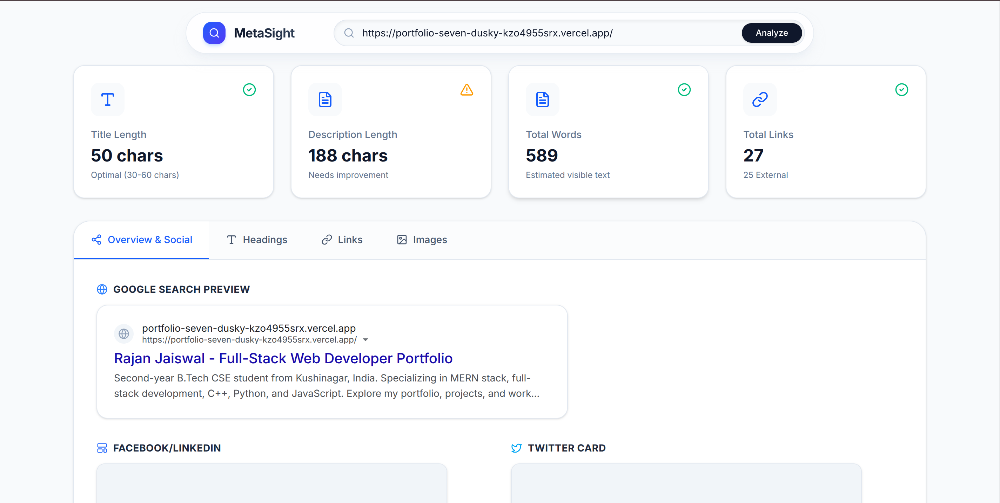
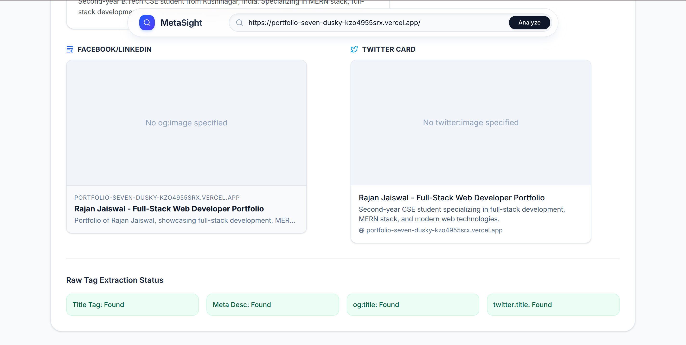

# MetaSight

A high-performance SEO tag inspector and website analyzer built in React.

**Live Demo:** [https://meta-sight-theta.vercel.app/](https://meta-sight-theta.vercel.app/)

<p align="center">
  
  
  
  
</p>

## Screenshots
<p align="center">
  
</p>
<p align="center">
  
</p>
<p align="center">
  
</p>

## Table of Contents

- [Overview](#overview)
- [Features](#features)
- [Tech Stack](#tech-stack)
- [Getting Started](#getting-started)
  - [Prerequisites](#prerequisites)
  - [Installation](#installation)
- [Usage](#usage)
- [License](#license)

## Overview

MetaSight provides comprehensive, real-time metadata analysis for any public URL. It functions by bypassing CORS restrictions using a reliable proxy, extracting raw DOM structures, and parsing critical SEO information without requiring backend infrastructure. It is designed for developers, SEO specialists, and technical marketers needing immediate, aggregated page data.

## Features

- 🔍 **Real-time DOM Extraction**: Fetches and parses live HTML from target URLs using browser-native `DOMParser` and the `allorigins.win` proxy.
- 📱 **Metadata Simulator**: Reconstructs and tests Open Graph, Twitter Cards, and standard Google Search Result formats.
- 📐 **Semantic Analysis**: Deep-scans document structures, outlining `<h1>` through `<h6>` cascades for accessibility and content hierarchy validation.
- 🖼️ **Media Auditing**: Processes all `` nodes systematically to identify and surface missing or malformed `alt` attributes.
- 🔗 **Link Classification**: Aggregates anchor tags to categorize internal vs. external routing ratios and identifies `nofollow` link assertions.
- ⚡ **Client-Side Processing**: Zero-latency metrics calculation directly within the browser thread via React states.

## Tech Stack

- **Framework**: React 18 + Vite
- **Language**: TypeScript
- **CSS Engine**: Tailwind CSS v4
- **State/Animations**: Framer Motion
- **Data Engine**: Native Fetch API & DOMParser

## Getting Started

### Prerequisites

- Node.js (v18 or higher recommended)
- npm or yarn

### Installation

1. Clone the repository (or navigate to your local working directory if already instantiated).
2. Install dependencies:
   ```bash
   npm install
   ```
3. Start the development server:
   ```bash
   npm run dev
   ```

## Usage

1. Open http://localhost:5173 in your browser.
2. Paste any valid public URL (e.g., `https://github.com` or `https://react.dev`) into the floating search bar.
3. Click **Analyze** and explore the generated dashboard.

## License

This project is licensed under the MIT License - see the LICENSE file for details.
